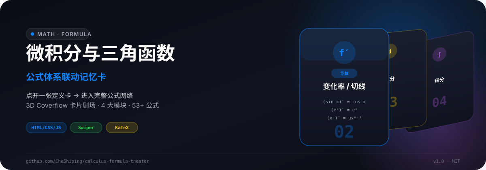
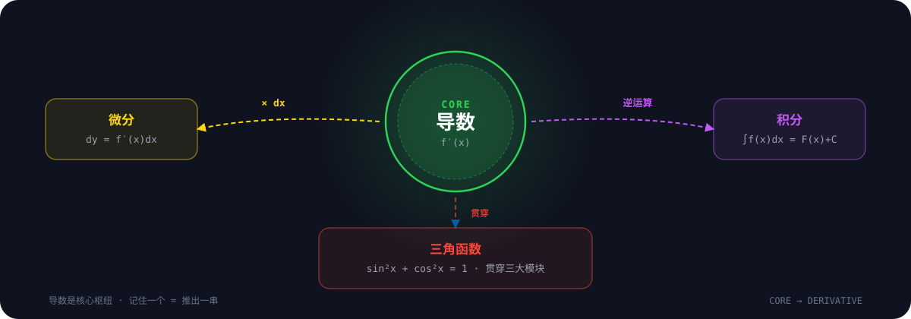
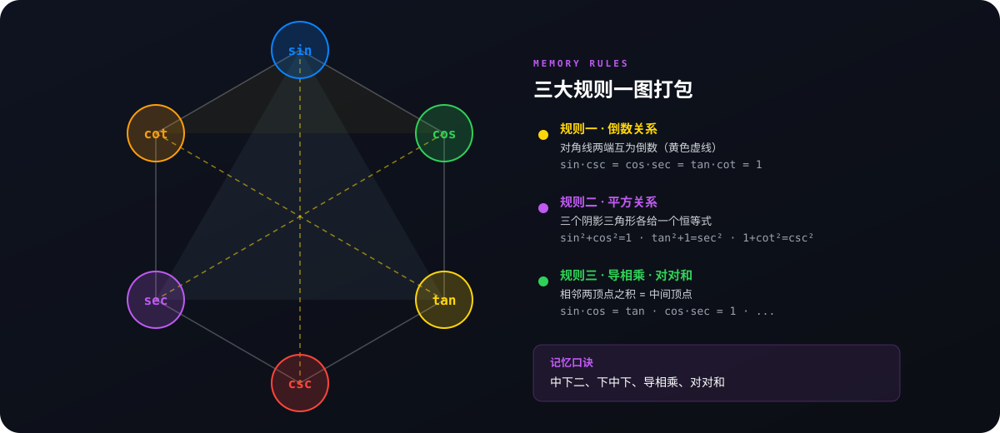

<p align="center">
  
</p>

<p align="center">
  <a href="https://cheshiping.github.io/calculus-formula-theater/"><strong>🌐 在线演示</strong></a>&nbsp;&nbsp;·&nbsp;&nbsp;
  <a href="#-本地运行"><strong>🚀 本地运行</strong></a>&nbsp;&nbsp;·&nbsp;&nbsp;
  <a href="#-内容覆盖"><strong>📚 内容覆盖</strong></a>
</p>

---

## 这是什么

一套用 **3D Coverflow 卡片剧场 + 公式详情页**重新组织的四川专升本高数框架梳理系统。

不再是死记硬背的清单，而是「**点开一张定义卡 → 进入完整知识网络**」的联动记忆体验。每张卡片背后藏着对应模块的全部知识——一个不漏，配合结构化记忆文本，帮你建立完整的知识网络。

**适合谁**：四川专升本考生、正在学高等数学、需要快速查阅公式并理解联动关系的学生。

> 📖 **文字版笔记**：网站内容同步整理为 Markdown 笔记，位于 [`notes/`](./notes) 目录，按章节分文件，方便离线学习与复习。详见 [笔记索引](./notes/00-笔记索引.md)。

---


### 沉浸式 3D 卡片剧场

- **Coverflow 3D 轮播** — Apple 风格 3D 透视卡片，键盘 / 鼠标滚轮 / 点击三种导航
- **侧边栏叙事** — 左侧实时同步当前卡片的解说、要点、模块进度
- **荧光笔高亮** — 选中卡片关键字段划线高亮，视觉聚焦

### 结构化记忆，不是堆公式

每条公式都配有**记忆口诀**和**联动关系说明**：

| 联动 | 说明 |
|------|------|
| 导数 ↔ 积分 | 记住 `(tan x)' = sec²x` → 自动知道 `∫sec²x dx = tan x + C` |
| 导数 ↔ 微分 | 导数公式 × `dx` 就是微分公式，不用单独背 |
| 二倍角 ↔ 降幂 | `cos2α` 三种形式 ↔ `sin²x` / `cos²x` 降幂 |
| 平方关系 ↔ 六边形 | `sin²+cos²=1` → 推导倒数、商数、平方关系 |

### 深色 / 浅色双主题

- 右上角一键切换，选择持久化到 `localStorage`
- 首次访问跟随系统 `prefers-color-scheme`
- 所有组件（卡片、详情页、六边形 SVG、公式块）全部适配双主题

---



---


| 技术 | 用途 |
|------|------|
| **原生 HTML/CSS/JS** | 单文件应用，无框架依赖 |
| [Tailwind CSS](https://tailwindcss.com/) | 原子化样式 |
| [Swiper](https://swiperjs.com/) | 3D Coverflow 卡片轮播 |
| [KaTeX](https://katex.org/) | 数学公式渲染（`$...$` 和 `$$...$$`） |
| [Font Awesome](https://fontawesome.com/) | 图标库 |
| **CSS 自定义属性** | 深色/浅色主题切换 |

---

## 🚀 本地运行

```bash
# 安装依赖
npm install

# 启动开发服务器（默认 http://localhost:8001）
npm run dev

# 构建产物（纯拷贝 src/ → dist/output/）
npm run build
```

> 也可以直接用浏览器打开 `src/index.html`，无需构建。

---


五张定义卡分别通往对应的完整公式详情页：

| # | 模块 | 定义卡内容 | 详情页内容 |
|---|------|-----------|-----------|
| 01 | <span style="color:#0A84FF">总览</span> | 四大模块联动关系 | 全景导航，一键跳转任意模块 |
| 02 | <span style="color:#30D158">导数</span> | 定义 + 几何/物理意义 | **18 条导数公式**，按函数类型分组 |
| 03 | <span style="color:#FFD60A">微分</span> | `dy = f'(x)dx` | **16 条微分公式 + 3 类微分方程** |
| 04 | <span style="color:#BF5AF2">积分</span> | `∫f(x)dx = F(x)+C` | **常见 11 条 + 特殊 8 条**积分公式 |
| 05 | <span style="color:#FF453A">三角函数</span> | `sin²+cos²=1` | **6 大版块**：关系/特殊值/升降幂/六边形/诱导 |

### 导数（18 条）

常数 & 幂函数 · 三角函数 · 指数 & 对数 · 反三角函数

> **记忆要点**：幂函数降次、`eˣ` 不变、三角「正变余、余变负」

### 微分（16 条 + 3 类方程）

微分公式 = 导数 × `dx` · 可分离变量方程 · 齐次方程 · 一阶线性非齐次方程

> **记忆要点**：微分不用单独背，导数右侧加 `dx` 即可

### 积分（11 + 8 条）

基本积分公式（导数逆运算） · 特殊积分（`tan` / `sec` / 含 `a²` 型）

> **记忆口诀**：塞进去弹出来，a 在前面用 arc

### 三角函数（6 大版块）

1. **关系与特殊值** — 0°~360° 特殊值表 + 15° 实记值
2. **常见关系** — 倒数 · 商数 · 平方
3. **升幂缩角** — 二倍角公式（`cos2α` 三种形式）
4. **降幂扩角** — `sin²x` / `cos²x` 降幂
5. **六边形记忆法** — 交互式 SVG + 三大规则
6. **诱导公式** — 「奇变偶不变，符号看象限」八字口诀

---




三角函数详情页内置**交互式六边形 SVG**：

- 六个顶点 = 六个三角函数
- **对角线（黄色虚线）** = 倒数关系
- **三个阴影三角形** = 平方关系
- 鼠标悬停顶点放大发光

> **记忆口诀**：中下二、下中下、导相乘、对对和

---

## 🎮 交互方式

| 操作 | 效果 |
|------|------|
| `←` / `→` | 切换卡片 |
| 鼠标滚轮 | 翻页卡片 |
| 点击居中卡片 | 进入对应模块详情页 |
| `Esc` | 从详情页返回卡片剧场 |
| 点击右上角 ☀️/🌙 | 切换深色/浅色主题 |
| 详情页顶部 Tab | 切换该模块的子版块 |

---

## 📁 项目结构

```
.
├── src/
│   └── index.html          # 单文件应用（HTML + CSS + JS 全内联）
├── assets/
│   └── readme/             # README 视觉资产（SVG）
├── .github/
│   └── workflows/
│       └── deploy.yml      # GitHub Pages 自动部署
├── package.json
└── README.md
```

---

## 🎨 设计理念

- **暗色科技风**为主调，Apple 系配色（蓝/绿/黄/紫/红）
- **玻璃拟态**卡片 + `backdrop-filter` 模糊
- **渐进式讲解**：定义卡 → 详情页 → 分组公式 → 记忆口诀
- **联动记忆**代替孤立背诵：导数↔积分、二倍角↔降幂、平方关系↔六边形

---

## ⭐ Star History

[](https://github.com/CheShiping/calculus-formula-theater/stargazers)
[](https://github.com/CheShiping/calculus-formula-theater/forks)
[](https://github.com/CheShiping/calculus-formula-theater/watchers)

<!-- Star History 趋势图：仓库 Star 数量达到一定值后可启用下方嵌入 -->
<!-- [](https://star-history.com/#CheShiping/calculus-formula-theater&Date) -->

---

## 📝 License

MIT
